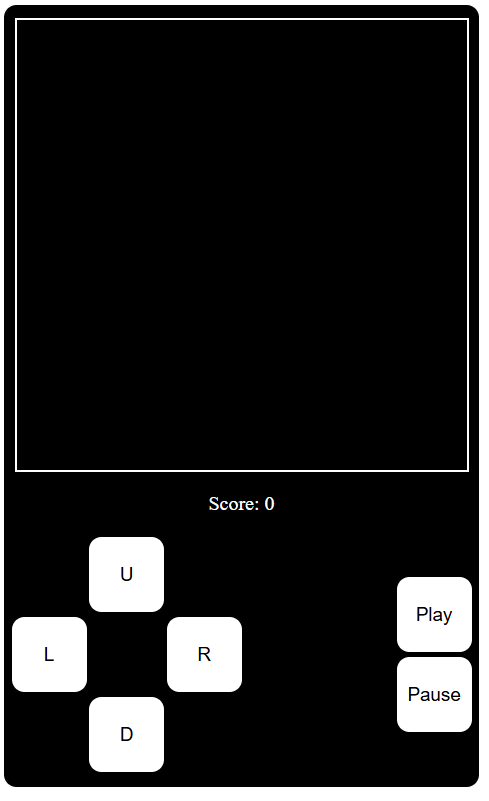
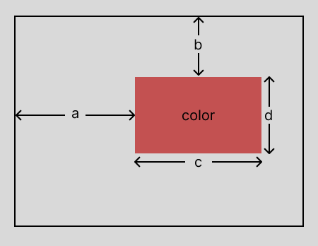

# MIN-SNAKE

This is an attempt to embed a game of snake into a qr-code, which is obviously inspired by the now viral youtube video "[Can you fit a whole game into a QR code?](https://www.youtube.com/watch?v=ExwqNreocpg)". In the video, Youtuber MattKC places an entire native windows executable file inside a qr-code, so that one can scan it in a windows machine and run the game with relative ease. Unfortunately, this is not a cross-platform solution, so here is my attempt at a cross-platform way to achieve the same.

## Introduction

In the video itself, MAttKC suggests that the easiest way to achieve this is to embed a static html page with javascript for the game logic inside a data-url. Then we can just scan the qr-code, copy the data url into a web browser's address bar and PRESTO!, we have our game running in the browser. This is technically a cross-platform solution, because every device has a web browser, therefore every device can read data-urls and can render html and run javascript. I just had to make it so that this game inside a html file is playable on mobile devices, and small enough to fit in a qr-code and I should be done.

## Game Display and Mobile Support

Html has a `<canvas>` tag, which gives us a game screen where we can change arbitrary pixels and hence display our game objects without actually worrying about rendering each game object as seperate DOM elements. If I was just targetting desktops, I would be done with the display, but for mobile devices, we would need a few buttons to allow the mobile player to move the snake, pause the game, etc.

This is the html code I have used to create the display:

```
<meta name="viewport" content="width=device-width,initial-scale=1.0" />
<style>
	.row {
		display: flex;
		align-items: center;
		gap: 60px;
	}
	.column {
		display: flex;
		flex-direction: column;
		align-items: center;
	}
	button {
		width: 60px;
		height: 60px;
		font-size: 15;
		margin: 2px;
		border: none;
		border-radius: 10px;
		background-color: white;
	}
	.container {
		padding: 10px;
		width: 360px;
		background-color: black;
		color: white;
		border-radius: 10px;
	}
</style>
<div class="column container">
	<canvas width="360" height="360" style="border: 2px solid white"></canvas>
	<p>Score: <span>0</span></p>
	<div class="row">
		<div class="column">
			<button>U</button>
			<div class="row">
				<button>L</button>
                <button>R</button>
			</div>
			<button>D</button>
		</div>
		<div style="flex-grow: 1"></div>
		<div class="column">
			<button>Play</button>
            <button>Pause</button>
		</div>
	</div>
</div>
```

Here is what it would look like at this point:



Then we just need to write the game logic in a script tag under the main div tag, add an event listener for keypresses for desktop users and onclick listeners to the buttons for mobile users.

## Game logic

### Step 1: Listing Features

Before we proceed to writing our game logic, we need to figure out all of the necessary and optional features of our game. In this section we will focus on the necessary features.

Firstly, we would need access to the `<canvas>` tag so that we can draw to it from javascript, and access to the `<span>` tag that displays the score. For variables that would keep track of game state, we would need an array of all the cells the snake would occupy in the board, a vector which holds the position of the fruit, a vector for the current direction the snake is travelling in, and a boolean to keep track of whether the game is playing or paused/stopped.

> Here we assumed that the board is 360x360 pixels, which is divided into a 20x20 board of cells, each of which is 18x18 pixels

Here is the code for the same (this is inside a `<script>` tag, I am omitting it for convenience):

```
const game = document.querySelector("canvas").getContext("2d");
const score = document.querySelector("span");
let snake;
let fruit;
let dir;
let is_playing = false;
```

At this point, some game variables are not initialized. We will do this later.

We will also implement a prompt queueing feature. In other words, we will make it so that if the player chenges direction twice in quick succession, instead of changing direction in a single step (which would in most cases be illegal), we will add the directions to a queue, from which we will take only one direction on every iteration of the game loop. Here is the variable for the queue:

```
let dir_queue;
```

### Step 2: Function to Display to the Screen

Here we will code the function necessary to display our snake and fruit to the screen. Firstly we will see how to display a rectangle to the canvas. Following is the code:

```
game.fillStyle = color;
game.fillRect(a, b, c, d);
```

Here `color` can be any rgb color, or any predefined color in CSS inside a string. So we can have `game.fillStyle = '#2596be'` or `game.fillStyle = 'rgb(37, 150, 190)'` or `game.fillStyle = 'black'` or any other way you can define a CSS color. `a` is the distance of the rectangle from the left of the canvas, `b` is the distance from the top, `c` is the length of the rectangle in the x-direction, `d` is the length in the y-direction.



Now let us write the code to render the snake to the screen.

```
function render_single(color, pos) {
    // helper function to render a single cell in the board with a given color and position
    game.fillStyle = color;
    game.fillRect(pos[0] * 18, pos[1] * 18, 18, 18);
}

function render() {
    // clear screen before rendering
    game.fillStyle = 'black';
    game.fillRect(0, 0, 360, 360);

    // render snake
    snake.forEach(cell => render_single('lightgreen', cell));

    // render fruit
    render_single('orange', fruit);
}
```

`render_single` is a helper function, and `render` is the actual function. With this, we have finished all the display related functionality of the game, we only need to call `render` once every frame of the game loop.

### Step 3: Make a New Fruit

Now we need a function to make a fruit for when we start the game, and when the snake eats the fruit.

```
function _rand() {
    return Math.floor(Math.random() * 20);
}

function make_fruit() {
    do {
        fruit = [_rand(), _rand()];
    } while (snake.some(cell => cell[0] == fruit[0] && cell[1] == fruit[1]))
}
```

The function `_rand` is a helper function to generate a random number between 0 and 19, inclusive. Then, in the `make_fruit` function, we create a random position for the fruit, and we do this until the fruit is not generated on the snake.

### Step 4: Moving the snake

-   To move the snake, we need to first get the direction the snake is moving in. Firstly, if `dir-queue` is not empty, we need to remove the first direction from it (we will add new directions to the end of `dir-queue` and remove directions from the front), and update `dir` with it.

-   Then we create a new head for the snake by moving the old head (`snake[0]`) by `dir`. Then we check if the head is out of the bounds of the board or has overlapped with the body of the snake. This would imply that the snake has either collided with the walls of the board or with itself and we need to end the game. If there are no such collisions, we can add the new head to the front of `snake` and continue.

-   Then we check if this new head overlaps with the position of the fruit, this would mean that the snake has eaten the fruit. If it does overlap, then we can increment the score and return from the function, and if it does not overlap, we must remove the last element of the snake.

Here is the function:

```
function move() {
    // update the direction if direction-queue is not empty
    if (dir_queue.length) dir = dir_queue.shift();

    // create new head, check for collisions
    const head = [snake[0][0] + dir[0], snake[0][1] + dir[1]];
    if (head[0] < 0 || head[1] < 0 ||
        head[0] > 19 || head[1] > 19 ||
        snake.some(cell => head[0] == cell[0] && head[1] == cell[1])
    ) {
        is_playing = false;
        return;
    }

    // add new head to snake
    snake.unshift(head);

    // check if head overlaps with fruit
    if (head[0] == fruit[0] && head[1] == fruit[1]) score.innerText = parseInt(score.innerText) + 1;
    else snake.pop();
}
```

### Step 5: Game Loop

we will now write the game loop:

```
function run() {
    if (is_playing) {
        setTimeout(() => {
            move();
            render();
            run();
        }, 200);
    }
}
```

we are doing this weird recursive call to the game loop instead of writing a simple while-loop because javascript doesn't seem to have a normal `delay` function.

### Step 6: Initialization

Now we will initialize the variables, inside a function, so that we can play the game multiple times without reloading the page.

```
function begin() {
    if (is_playing) {
        snake = [...Array(5).keys()].map(i=>[10,10+i]); // snake = [[10,10],[10,11],[10,12],[10,13],[10,14]];
        make_fruit();
        dir = [0, -1];
        dir_queue = [];
        render();
        run();
    }
}
```

Here, we are using `snake = [...Array(5).keys()].map(i=>[10,10+i]);` instead of `snake = [[10,10],[10,11],[10,12],[10,13],[10,14]];` only because the former is a smaller string than the latter. Otherwise they both result in a snake with a body of 5 cells starting from `[10, 10]` and ending in `[10, 14]`.

### Step 7: Add a Direction to `dir_queue`

we now need a function to add a direction to `dir_queue`.

-   We create a new veriable `comp` to compare the new direction against. We first check if `dir_queue` is empty. If it is, then the `comp` is the current direction, else `comp` is the last direction added to `dir_queue`.

-   Then we check if the new direction is orthogonal to `comp`. Only if the new direction is orthogonal, we add it to the end of `dir_queue`.

Here is the function:

```
function add(new_dir) {
    // get the variable to compare the new direction against
    let comp;
    if (dir_queue.length) comp = dir_queue[dir_queue.length - 1];
    else comp = dir;

    // compare the new direction and add to dir_queue
    if (new_dir[0] * comp[0] + new_dir[1] * comp[1] == 0) dir_queue.push(new_dir);
}
```

### Step 8: Functions to Play/Pause and Play/Stop the Game

Here are functions to toggle `is_playing` and either call `run()` (when the game is paused/unpaused) or `begin()` (when the game is stopped/restarted).

```
function toggle_pause() {
    is_playing = !is_playing;
    if(snake) run();
}

function toggle_stop() {
    is_playing = !is_playing;
    begin();
}
```

### Step 9: Add Event Listener to Listen to Key Presses

Now we need to add the event listener to allow desktop players to use keyboard inputs to play the game. We will use the arrow keys to move the snake, the spacebar to pause and unpause the game, and the 'Enter' key to initially start, stop and restart the game. Here is the code:

```
document.addEventListener("keydown", e => {
    switch (e.key) {
        case "ArrowUp":
            add([0,-1]);
            break;
        case "ArrowDown":
            add([0,1]);
            break;
        case "ArrowLeft":
            add([-1,0]);
            break;
        case "ArrowRight":
            add([1,0]);
            break;
        case "Enter":
            toggle_stop();
            break;
        case " ":
            toggle_pause();
            break;
    }
})
```

With this function, our game will be fully playable on desktop.

### Step 10: Add Mobile Support

For this, we need only call the same functions we called in the event listener when the corresponding buttons in the display are pressed. Here is the modified html, now with just the container `div`:

```
<div class="column container">
	<canvas width="360" height="360" style="border: 2px solid white"></canvas>
	<p>Score: <span>0</span></p>
	<div class="row">
		<div class="column">
			<button onclick="add([0,-1])">U</button>
			<div class="row">
				<button onclick="add([-1,0])">L</button>
                <button onclick="add([1,0])">R</button>
			</div>
			<button onclick="add([0,1])">D</button>
		</div>
		<div style="flex-grow: 1"></div>
		<div class="column">
			<button onclick="toggle_stop()">Play</button>
            <button onclick="toggle_pause()">Pause</button>
		</div>
	</div>
</div>
```

With this, our game is fully playable on both desktop and mobile devices.

## Minification and creating the QR-Code

I will not discuss the minification of the html file or the python script to create the qr-code in detail, because you can simply read the files for yourselves, the python file is rather easy to understand, and given the tutorial on top, the minified html file is also easy to understand, if you realise that some functions that are only called once are inlined istead of defining the function and using it only once.